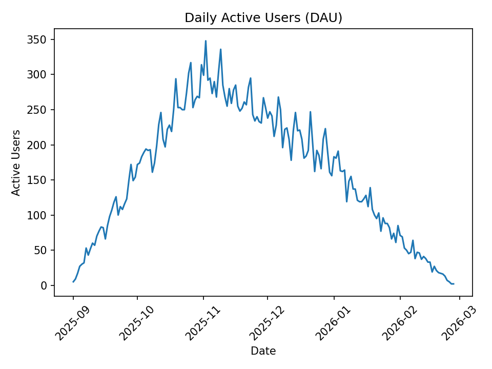
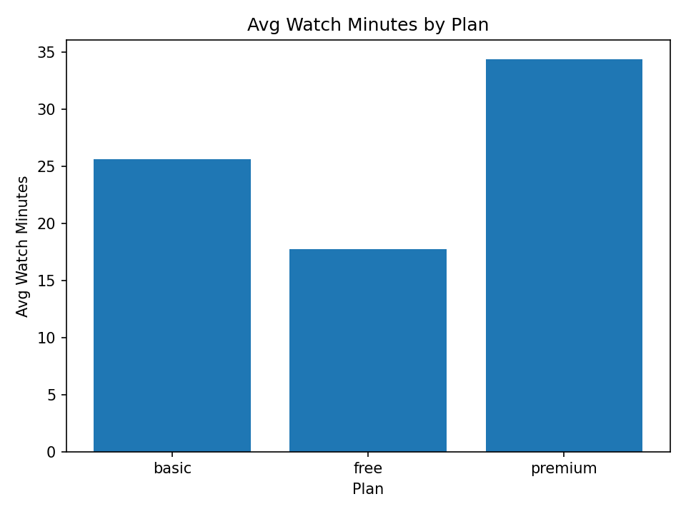
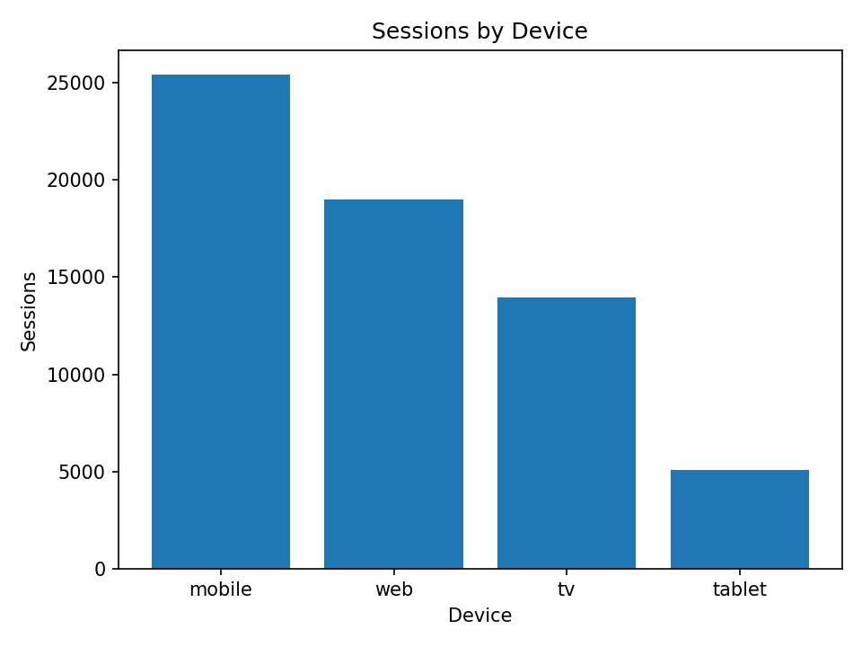
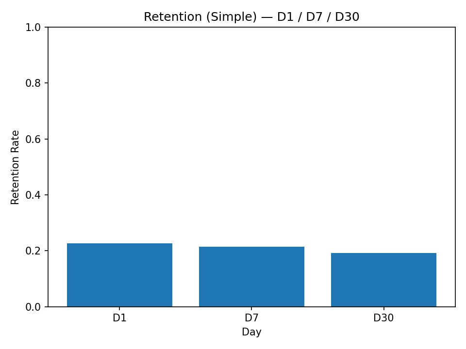

# Streaming Retention Analysis

Subscription retention + engagement analysis using Python & KPI reporting.

## Overview
This project analyzes user streaming behavior to identify retention trends and engagement drivers.

**Goal:** Understand which user segments, subscription plans, and devices influence watch activity and retention.

## Key Questions Answered
- How does engagement change over time (Daily Active Users)?
- Which subscription plans have the highest watch minutes?
- Which devices generate the most sessions?
- What does retention look like across D1, D7, and D30?

---

## Key KPIs & Visuals

### Daily Active Users (DAU)


### Avg Watch Minutes by Plan


### Sessions by Device


### Retention (Simple) — D1 / D7 / D30


---

## Tools Used
- Python (Pandas, NumPy, Matplotlib)
- SQL (analysis queries)
- KPI reporting / visual storytelling

---

## SQL Analysis
SQL queries are located in the `/sql` folder and support KPI calculations for:
- Daily Active Users (DAU)
- Watch minutes by plan
- Sessions by device
- Retention (D1/D7/D30)

---

## Project Structure
- `/data` → datasets (CSV files)
- `/python` → scripts for data generation + chart creation
- `/sql` → SQL queries used for KPI analysis
- `/visuals` → output charts displayed in README

---

## How to Run Locally

### 1) Clone the repository
```bash
git clone https://github.com/ehernandez101/streaming-retention-analysis.git
cd streaming-retention-analysis
pip install pandas numpy matplotlib
py python/00_generate_data.py
py python/01_create_charts.py
```
---

## Notes
- Dataset is synthetic (generated for portfolio purpose).
- Visuals were generated using Pything scripts inside /python.
